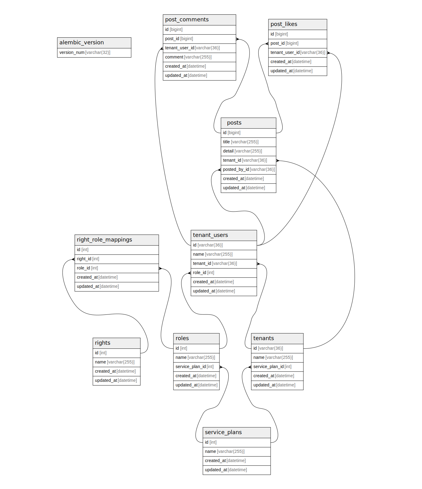

# mydb

## Tables

| Name | Columns | Comment | Type |
| ---- | ------- | ------- | ---- |
| [alembic_version](alembic_version.md) | 1 |  | BASE TABLE |
| [post_comments](post_comments.md) | 6 | 投稿コメント | BASE TABLE |
| [post_likes](post_likes.md) | 5 | 投稿いいね | BASE TABLE |
| [posts](posts.md) | 7 | 投稿 | BASE TABLE |
| [right_role_mappings](right_role_mappings.md) | 5 | 権限ロールマッピング | BASE TABLE |
| [rights](rights.md) | 4 | 権限 | BASE TABLE |
| [roles](roles.md) | 5 | ロール(1:super, 10:basic plan member, 11:basic plan Admin, 20: premium plan member,  21: premium plan admin 99:停止ユーザー | BASE TABLE |
| [service_plans](service_plans.md) | 4 | サービスプラン | BASE TABLE |
| [tenant_users](tenant_users.md) | 6 | ユーザー | BASE TABLE |
| [tenants](tenants.md) | 5 |  | BASE TABLE |

## Relations

---

> Generated by [tbls](https://github.com/k1LoW/tbls)
