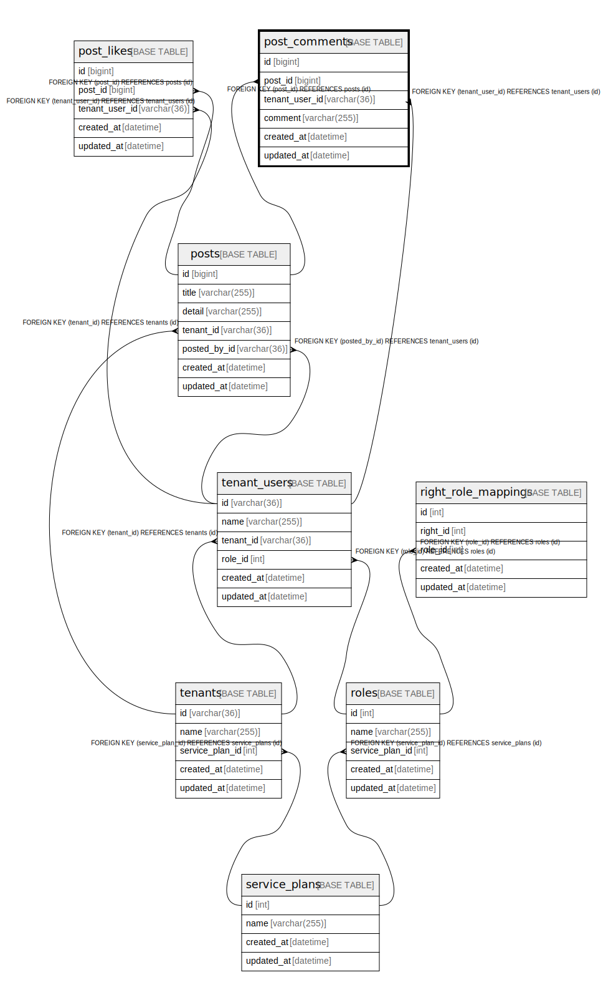

# post_comments

## Description

投稿コメント

<details>
<summary><strong>Table Definition</strong></summary>

```sql
CREATE TABLE `post_comments` (
  `id` bigint NOT NULL AUTO_INCREMENT,
  `post_id` bigint NOT NULL,
  `tenant_user_id` varchar(36) NOT NULL,
  `comment` varchar(255) NOT NULL,
  `created_at` datetime NOT NULL,
  `updated_at` datetime NOT NULL,
  PRIMARY KEY (`id`),
  UNIQUE KEY `uq_post_comments_post_id` (`post_id`,`tenant_user_id`),
  KEY `fk_post_comments_tenant_user_id_tenant_users` (`tenant_user_id`),
  CONSTRAINT `fk_post_comments_post_id_posts` FOREIGN KEY (`post_id`) REFERENCES `posts` (`id`) ON DELETE CASCADE,
  CONSTRAINT `fk_post_comments_tenant_user_id_tenant_users` FOREIGN KEY (`tenant_user_id`) REFERENCES `tenant_users` (`id`) ON DELETE CASCADE
) ENGINE=InnoDB DEFAULT CHARSET=utf8mb4 COLLATE=utf8mb4_0900_ai_ci COMMENT='投稿コメント'
```

</details>

## Columns

| Name | Type | Default | Nullable | Extra Definition | Children | Parents | Comment |
| ---- | ---- | ------- | -------- | --------------- | -------- | ------- | ------- |
| id | bigint |  | false | auto_increment |  |  |  |
| post_id | bigint |  | false |  |  | [posts](posts.md) |  |
| tenant_user_id | varchar(36) |  | false |  |  | [tenant_users](tenant_users.md) |  |
| comment | varchar(255) |  | false |  |  |  |  |
| created_at | datetime |  | false |  |  |  |  |
| updated_at | datetime |  | false |  |  |  |  |

## Constraints

| Name | Type | Definition |
| ---- | ---- | ---------- |
| fk_post_comments_post_id_posts | FOREIGN KEY | FOREIGN KEY (post_id) REFERENCES posts (id) |
| fk_post_comments_tenant_user_id_tenant_users | FOREIGN KEY | FOREIGN KEY (tenant_user_id) REFERENCES tenant_users (id) |
| PRIMARY | PRIMARY KEY | PRIMARY KEY (id) |
| uq_post_comments_post_id | UNIQUE | UNIQUE KEY uq_post_comments_post_id (post_id, tenant_user_id) |

## Indexes

| Name | Definition |
| ---- | ---------- |
| fk_post_comments_tenant_user_id_tenant_users | KEY fk_post_comments_tenant_user_id_tenant_users (tenant_user_id) USING BTREE |
| PRIMARY | PRIMARY KEY (id) USING BTREE |
| uq_post_comments_post_id | UNIQUE KEY uq_post_comments_post_id (post_id, tenant_user_id) USING BTREE |

## Relations



---

> Generated by [tbls](https://github.com/k1LoW/tbls)
