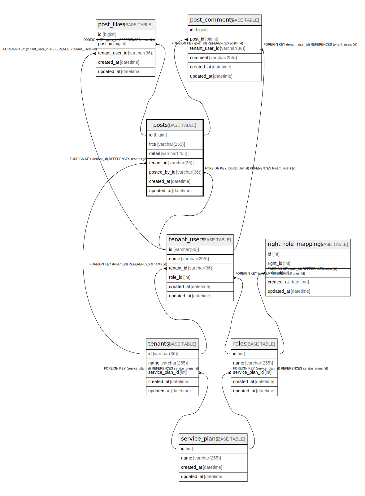

# posts

## Description

投稿

<details>
<summary><strong>Table Definition</strong></summary>

```sql
CREATE TABLE `posts` (
  `id` bigint NOT NULL AUTO_INCREMENT,
  `title` varchar(255) NOT NULL,
  `detail` varchar(255) NOT NULL,
  `tenant_id` varchar(36) NOT NULL,
  `posted_by_id` varchar(36) NOT NULL,
  `created_at` datetime NOT NULL,
  `updated_at` datetime NOT NULL,
  PRIMARY KEY (`id`),
  UNIQUE KEY `uq_posts_title` (`title`,`tenant_id`),
  KEY `fk_posts_posted_by_id_tenant_users` (`posted_by_id`),
  KEY `fk_posts_tenant_id_tenants` (`tenant_id`),
  CONSTRAINT `fk_posts_posted_by_id_tenant_users` FOREIGN KEY (`posted_by_id`) REFERENCES `tenant_users` (`id`) ON DELETE CASCADE,
  CONSTRAINT `fk_posts_tenant_id_tenants` FOREIGN KEY (`tenant_id`) REFERENCES `tenants` (`id`) ON DELETE CASCADE
) ENGINE=InnoDB DEFAULT CHARSET=utf8mb4 COLLATE=utf8mb4_0900_ai_ci COMMENT='投稿'
```

</details>

## Columns

| Name | Type | Default | Nullable | Extra Definition | Children | Parents | Comment |
| ---- | ---- | ------- | -------- | --------------- | -------- | ------- | ------- |
| id | bigint |  | false | auto_increment | [post_comments](post_comments.md) [post_likes](post_likes.md) |  |  |
| title | varchar(255) |  | false |  |  |  |  |
| detail | varchar(255) |  | false |  |  |  |  |
| tenant_id | varchar(36) |  | false |  |  | [tenants](tenants.md) |  |
| posted_by_id | varchar(36) |  | false |  |  | [tenant_users](tenant_users.md) |  |
| created_at | datetime |  | false |  |  |  |  |
| updated_at | datetime |  | false |  |  |  |  |

## Constraints

| Name | Type | Definition |
| ---- | ---- | ---------- |
| fk_posts_posted_by_id_tenant_users | FOREIGN KEY | FOREIGN KEY (posted_by_id) REFERENCES tenant_users (id) |
| fk_posts_tenant_id_tenants | FOREIGN KEY | FOREIGN KEY (tenant_id) REFERENCES tenants (id) |
| PRIMARY | PRIMARY KEY | PRIMARY KEY (id) |
| uq_posts_title | UNIQUE | UNIQUE KEY uq_posts_title (title, tenant_id) |

## Indexes

| Name | Definition |
| ---- | ---------- |
| fk_posts_posted_by_id_tenant_users | KEY fk_posts_posted_by_id_tenant_users (posted_by_id) USING BTREE |
| fk_posts_tenant_id_tenants | KEY fk_posts_tenant_id_tenants (tenant_id) USING BTREE |
| PRIMARY | PRIMARY KEY (id) USING BTREE |
| uq_posts_title | UNIQUE KEY uq_posts_title (title, tenant_id) USING BTREE |

## Relations



---

> Generated by [tbls](https://github.com/k1LoW/tbls)
