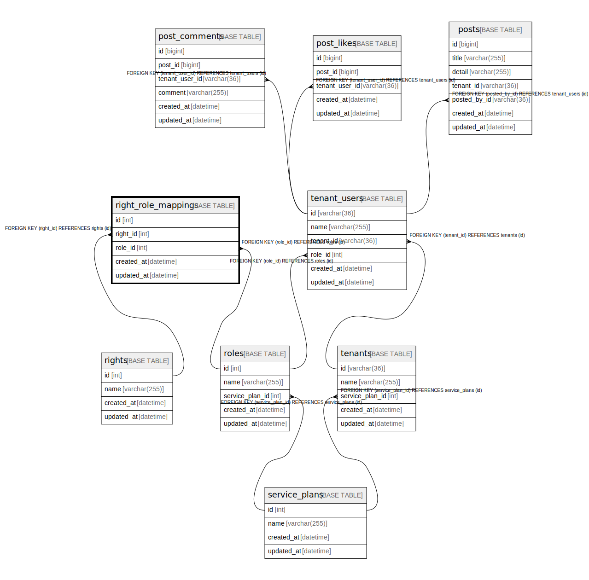

# right_role_mappings

## Description

権限ロールマッピング

<details>
<summary><strong>Table Definition</strong></summary>

```sql
CREATE TABLE `right_role_mappings` (
  `id` int NOT NULL AUTO_INCREMENT,
  `right_id` int NOT NULL,
  `role_id` int NOT NULL,
  `created_at` datetime NOT NULL,
  `updated_at` datetime NOT NULL,
  PRIMARY KEY (`id`),
  UNIQUE KEY `uq_right_role_mappings_right_id` (`right_id`,`role_id`),
  KEY `fk_right_role_mappings_role_id_roles` (`role_id`),
  CONSTRAINT `fk_right_role_mappings_right_id_rights` FOREIGN KEY (`right_id`) REFERENCES `rights` (`id`) ON DELETE CASCADE,
  CONSTRAINT `fk_right_role_mappings_role_id_roles` FOREIGN KEY (`role_id`) REFERENCES `roles` (`id`) ON DELETE CASCADE
) ENGINE=InnoDB DEFAULT CHARSET=utf8mb4 COLLATE=utf8mb4_0900_ai_ci COMMENT='権限ロールマッピング'
```

</details>

## Columns

| Name | Type | Default | Nullable | Extra Definition | Children | Parents | Comment |
| ---- | ---- | ------- | -------- | --------------- | -------- | ------- | ------- |
| id | int |  | false | auto_increment |  |  |  |
| right_id | int |  | false |  |  | [rights](rights.md) |  |
| role_id | int |  | false |  |  | [roles](roles.md) |  |
| created_at | datetime |  | false |  |  |  |  |
| updated_at | datetime |  | false |  |  |  |  |

## Constraints

| Name | Type | Definition |
| ---- | ---- | ---------- |
| fk_right_role_mappings_right_id_rights | FOREIGN KEY | FOREIGN KEY (right_id) REFERENCES rights (id) |
| fk_right_role_mappings_role_id_roles | FOREIGN KEY | FOREIGN KEY (role_id) REFERENCES roles (id) |
| PRIMARY | PRIMARY KEY | PRIMARY KEY (id) |
| uq_right_role_mappings_right_id | UNIQUE | UNIQUE KEY uq_right_role_mappings_right_id (right_id, role_id) |

## Indexes

| Name | Definition |
| ---- | ---------- |
| fk_right_role_mappings_role_id_roles | KEY fk_right_role_mappings_role_id_roles (role_id) USING BTREE |
| PRIMARY | PRIMARY KEY (id) USING BTREE |
| uq_right_role_mappings_right_id | UNIQUE KEY uq_right_role_mappings_right_id (right_id, role_id) USING BTREE |

## Relations



---

> Generated by [tbls](https://github.com/k1LoW/tbls)
