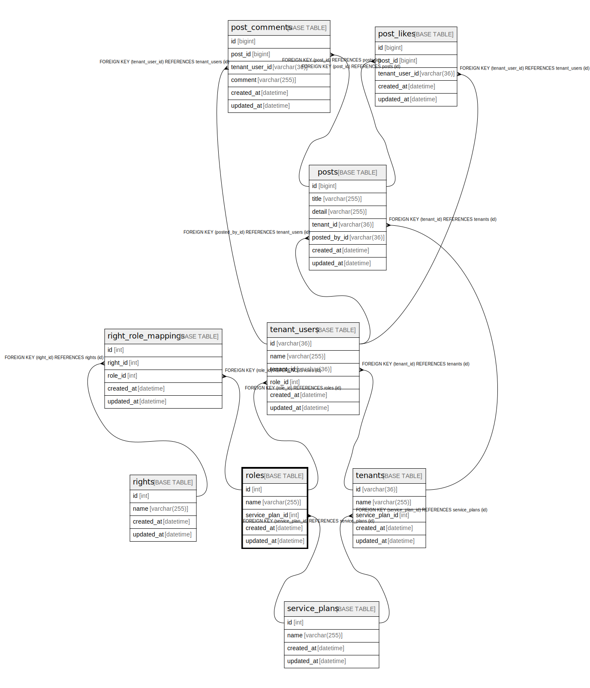

# roles

## Description

ロール(1:super, 10:basic plan member, 11:basic plan Admin, 20: premium plan member,  21: premium plan admin 99:停止ユーザー

<details>
<summary><strong>Table Definition</strong></summary>

```sql
CREATE TABLE `roles` (
  `id` int NOT NULL AUTO_INCREMENT,
  `name` varchar(255) NOT NULL,
  `service_plan_id` int NOT NULL,
  `created_at` datetime NOT NULL,
  `updated_at` datetime NOT NULL,
  PRIMARY KEY (`id`),
  UNIQUE KEY `uq_roles_name` (`name`),
  KEY `fk_roles_service_plan_id_service_plans` (`service_plan_id`),
  CONSTRAINT `fk_roles_service_plan_id_service_plans` FOREIGN KEY (`service_plan_id`) REFERENCES `service_plans` (`id`)
) ENGINE=InnoDB DEFAULT CHARSET=utf8mb4 COLLATE=utf8mb4_0900_ai_ci COMMENT='ロール(1:super, 10:basic plan member, 11:basic plan Admin, 20: premium plan member,  21: premium plan admin 99:停止ユーザー'
```

</details>

## Columns

| Name | Type | Default | Nullable | Extra Definition | Children | Parents | Comment |
| ---- | ---- | ------- | -------- | --------------- | -------- | ------- | ------- |
| id | int |  | false | auto_increment | [right_role_mappings](right_role_mappings.md) [tenant_users](tenant_users.md) |  |  |
| name | varchar(255) |  | false |  |  |  |  |
| service_plan_id | int |  | false |  |  | [service_plans](service_plans.md) |  |
| created_at | datetime |  | false |  |  |  |  |
| updated_at | datetime |  | false |  |  |  |  |

## Constraints

| Name | Type | Definition |
| ---- | ---- | ---------- |
| fk_roles_service_plan_id_service_plans | FOREIGN KEY | FOREIGN KEY (service_plan_id) REFERENCES service_plans (id) |
| PRIMARY | PRIMARY KEY | PRIMARY KEY (id) |
| uq_roles_name | UNIQUE | UNIQUE KEY uq_roles_name (name) |

## Indexes

| Name | Definition |
| ---- | ---------- |
| fk_roles_service_plan_id_service_plans | KEY fk_roles_service_plan_id_service_plans (service_plan_id) USING BTREE |
| PRIMARY | PRIMARY KEY (id) USING BTREE |
| uq_roles_name | UNIQUE KEY uq_roles_name (name) USING BTREE |

## Relations



---

> Generated by [tbls](https://github.com/k1LoW/tbls)
