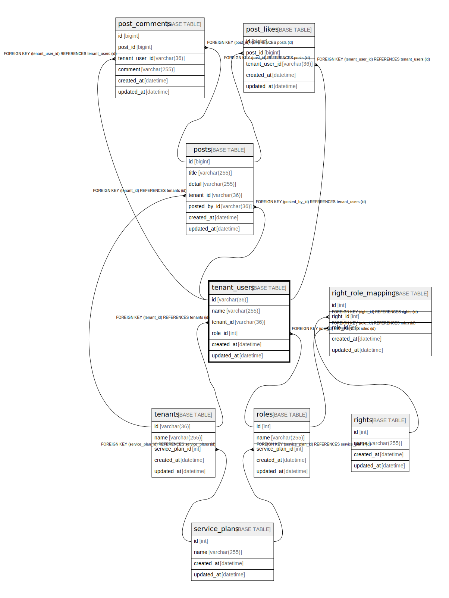

# tenant_users

## Description

ユーザー

<details>
<summary><strong>Table Definition</strong></summary>

```sql
CREATE TABLE `tenant_users` (
  `id` varchar(36) NOT NULL,
  `name` varchar(255) NOT NULL,
  `tenant_id` varchar(36) NOT NULL,
  `role_id` int NOT NULL,
  `created_at` datetime NOT NULL,
  `updated_at` datetime NOT NULL,
  PRIMARY KEY (`id`),
  UNIQUE KEY `uq_tenant_users_name` (`name`,`tenant_id`),
  KEY `fk_tenant_users_role_id_roles` (`role_id`),
  KEY `fk_tenant_users_tenant_id_tenants` (`tenant_id`),
  CONSTRAINT `fk_tenant_users_role_id_roles` FOREIGN KEY (`role_id`) REFERENCES `roles` (`id`),
  CONSTRAINT `fk_tenant_users_tenant_id_tenants` FOREIGN KEY (`tenant_id`) REFERENCES `tenants` (`id`) ON DELETE CASCADE
) ENGINE=InnoDB DEFAULT CHARSET=utf8mb4 COLLATE=utf8mb4_0900_ai_ci COMMENT='ユーザー'
```

</details>

## Columns

| Name | Type | Default | Nullable | Children | Parents | Comment |
| ---- | ---- | ------- | -------- | -------- | ------- | ------- |
| id | varchar(36) |  | false | [post_comments](post_comments.md) [post_likes](post_likes.md) [posts](posts.md) |  |  |
| name | varchar(255) |  | false |  |  |  |
| tenant_id | varchar(36) |  | false |  | [tenants](tenants.md) |  |
| role_id | int |  | false |  | [roles](roles.md) |  |
| created_at | datetime |  | false |  |  |  |
| updated_at | datetime |  | false |  |  |  |

## Constraints

| Name | Type | Definition |
| ---- | ---- | ---------- |
| fk_tenant_users_role_id_roles | FOREIGN KEY | FOREIGN KEY (role_id) REFERENCES roles (id) |
| fk_tenant_users_tenant_id_tenants | FOREIGN KEY | FOREIGN KEY (tenant_id) REFERENCES tenants (id) |
| PRIMARY | PRIMARY KEY | PRIMARY KEY (id) |
| uq_tenant_users_name | UNIQUE | UNIQUE KEY uq_tenant_users_name (name, tenant_id) |

## Indexes

| Name | Definition |
| ---- | ---------- |
| fk_tenant_users_role_id_roles | KEY fk_tenant_users_role_id_roles (role_id) USING BTREE |
| fk_tenant_users_tenant_id_tenants | KEY fk_tenant_users_tenant_id_tenants (tenant_id) USING BTREE |
| PRIMARY | PRIMARY KEY (id) USING BTREE |
| uq_tenant_users_name | UNIQUE KEY uq_tenant_users_name (name, tenant_id) USING BTREE |

## Relations



---

> Generated by [tbls](https://github.com/k1LoW/tbls)
