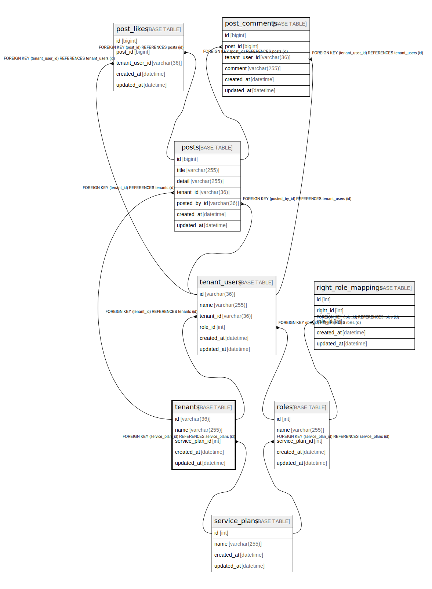

# tenants

## Description

<details>
<summary><strong>Table Definition</strong></summary>

```sql
CREATE TABLE `tenants` (
  `id` varchar(36) NOT NULL,
  `name` varchar(255) NOT NULL,
  `service_plan_id` int NOT NULL,
  `created_at` datetime NOT NULL,
  `updated_at` datetime NOT NULL,
  PRIMARY KEY (`id`),
  UNIQUE KEY `uq_tenants_name` (`name`),
  KEY `fk_tenants_service_plan_id_service_plans` (`service_plan_id`),
  CONSTRAINT `fk_tenants_service_plan_id_service_plans` FOREIGN KEY (`service_plan_id`) REFERENCES `service_plans` (`id`)
) ENGINE=InnoDB DEFAULT CHARSET=utf8mb4 COLLATE=utf8mb4_0900_ai_ci
```

</details>

## Columns

| Name | Type | Default | Nullable | Children | Parents | Comment |
| ---- | ---- | ------- | -------- | -------- | ------- | ------- |
| id | varchar(36) |  | false | [posts](posts.md) [tenant_users](tenant_users.md) |  |  |
| name | varchar(255) |  | false |  |  |  |
| service_plan_id | int |  | false |  | [service_plans](service_plans.md) |  |
| created_at | datetime |  | false |  |  |  |
| updated_at | datetime |  | false |  |  |  |

## Constraints

| Name | Type | Definition |
| ---- | ---- | ---------- |
| fk_tenants_service_plan_id_service_plans | FOREIGN KEY | FOREIGN KEY (service_plan_id) REFERENCES service_plans (id) |
| PRIMARY | PRIMARY KEY | PRIMARY KEY (id) |
| uq_tenants_name | UNIQUE | UNIQUE KEY uq_tenants_name (name) |

## Indexes

| Name | Definition |
| ---- | ---------- |
| fk_tenants_service_plan_id_service_plans | KEY fk_tenants_service_plan_id_service_plans (service_plan_id) USING BTREE |
| PRIMARY | PRIMARY KEY (id) USING BTREE |
| uq_tenants_name | UNIQUE KEY uq_tenants_name (name) USING BTREE |

## Relations



---

> Generated by [tbls](https://github.com/k1LoW/tbls)
